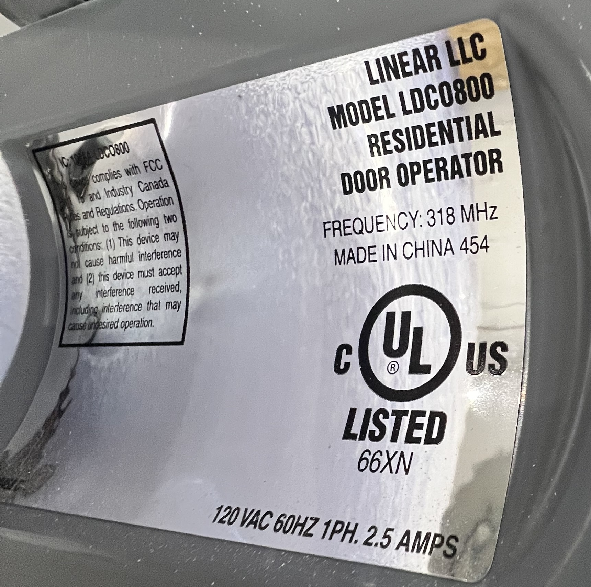
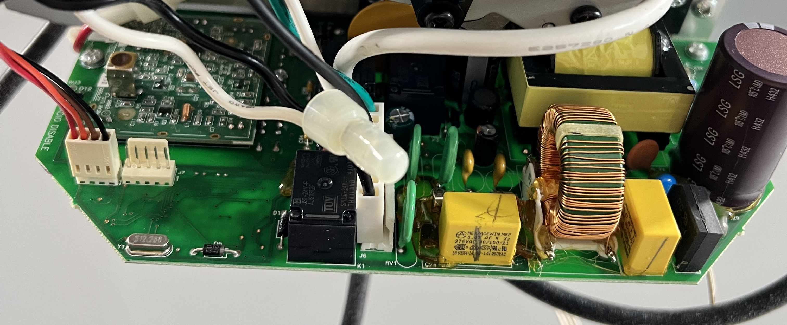
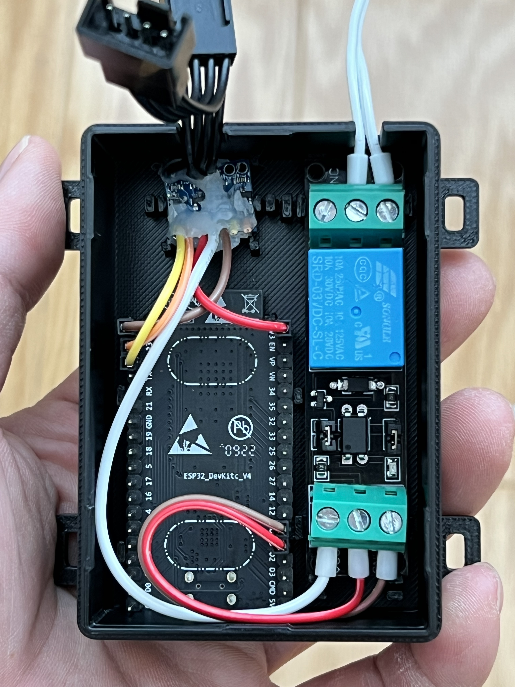
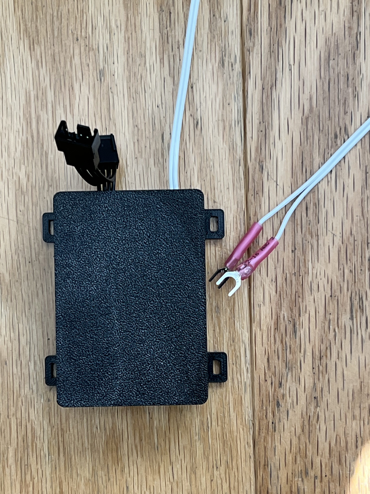

# Linear Garage Controller

ESP32 + ESPHome retrofit for a **Linear LDCO800** garage opener: encoder-based motion and estimated position, feedback-driven Open/Close control, Home Assistant integration, and Bluetooth Proxy.

**Completed / 项目完成：2026-09-18。** 保留原开门器、电机、遥控器、墙壁按钮和原厂保护功能。读取原厂编码器，通过继电器模拟按钮，在 ESP32 本地把 Open / Close 意图转换为有反馈的按钮序列。

## Project photos · 实物照片

| Gate model · 开门器型号 | Gate logic board · 原厂主板 |
|---|---|
|  |  |
| **Linear LDCO800** — model nameplate / 型号铭牌与电气规格。 | Original logic board and power section / 原厂主板与电源区域，保留编码器接口。 |

| Components in 3D-printed box · 盒内组件 | Finished module · 合盖成品 |
|---|---|
|  |  |
| ESP32 + level converter + 3.3 V relay / 打印盒内的三块电路板。 | Encoder Y cable, dry-contact leads and mounting ears / 编码器线束、按钮触点引线与固定耳。 |

Actual project photographs / 项目实物照片。型号与主板照片仅做普通裁剪，另外两张保留原画面；四张均去除相机元数据，没有 AI 重绘、修饰或添加标注。

## Features · 功能

- **Encoder feedback · 编码器反馈**：GPIO22/23 读取两路编码器信号，识别 opening / closing / stopped，估算开度。
- **Closed-position reference · 全关参考**：独立全关门磁经 HA 提供参考，稳定确认后校准零点。
- **Directional control · 定向控制**：Open Gate / Close Gate 支持最新目标优先；保留 Gate Button 原始单次按键。
- **Home Assistant**：HA `cover`、最后已知状态缓存、运动次数、行程耗时及异常提醒。
- **Apple Home**：可经 HA HomeKit Bridge 暴露为车库门。
- **Bluetooth Proxy**：支持广播转发与主动 BLE 连接；默认三个连接名额。

## Documentation · 资料导航

| Document · 资料 | Contents · 内容 |
|---|---|
| [Wiring & BOM · 接线与物料](docs/WIRING.md) | 编码器、转换板、ESP32、3.3 V 继电器 |
| [Control logic · 控制逻辑](docs/CONTROL.md) | 重复请求、换向、未知位置、脉冲限制 |
| [Firmware · 固件](firmware/README.md) | 构建、凭据、标定与首次接入 |
| [Home Assistant](home-assistant/README.md) | Cover、缓存、统计、通知与 HomeKit |
| [Enclosure & STL · 外壳模型](enclosure/README.md) | V0.27 底壳 / 上盖 STL、尺寸与网格核验 |
| [Tests · 测试](tests/README.md) | 独立 C++ 模拟与 Python 模板测试 |
| [Project summary · 项目总结](docs/PROJECT.md) | 实测、安装与蓝牙取舍 |

## Quick start · 快速开始

1. 阅读接线说明，核对自己开门器的端子、电压、线序及继电器规格。
2. 在 Python 环境安装 `requirements.txt`，按 [固件说明](firmware/README.md) 填入自己的配置。
3. 初次调试先断开继电器 COM/NO 控制线，确认编码器方向、门磁与继电器脉冲。
4. 将 ESPHome 设备加入 HA，按 [HA 说明](home-assistant/README.md) 核对实体 ID 并安装所需模板。
5. 完成现场验证后，再接入原厂 PUSHBUTTON / COMMON。

运行纯软件检查（不会连接 HA 或触发门）：

```sh
python tests/run_tests.py
```

## Scope and limitations · 适用范围

This is a device-specific retrofit, not a universal plug-and-play controller.

这是针对一台 LDCO800 的改造记录，不是所有开门器的通用即插即用方案。`1049` 全行程计数和计数方向来自本机实测，必须按自己的安装校准。`open_estimated` 表示计数估算的全开，没有独立全开限位。重启后位置未知是有意设计，历史缓存不替代当前反馈。

未知方向时，定向请求可先试探一次，因此可能短暂反向；HA Stop 也不是即时急停。原机的光束、遇阻反转与机械限位必须保留。进行机内接线前断开开门器电源；继电器触点仅连接低压按钮端子，**不切换 120 V 电源**。

这是经过私人信息清理的独立发布版：使用通用节点名和实体 ID，未包含家中凭据、网络地址、设备 MAC/序列号、原始运行日志或烧录二进制。已有安装升级时应保留自己的节点和实体身份，不要直接用示例改名覆盖。

许可及第三方来源见 [NOTICE.md](NOTICE.md)。
