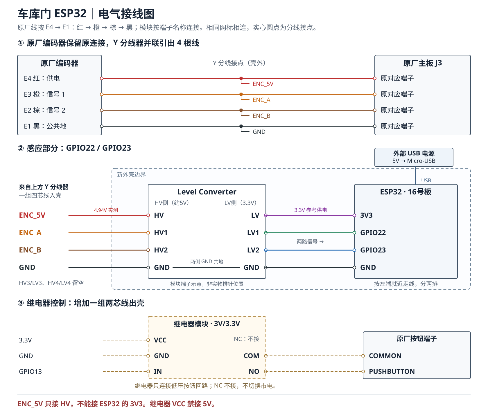
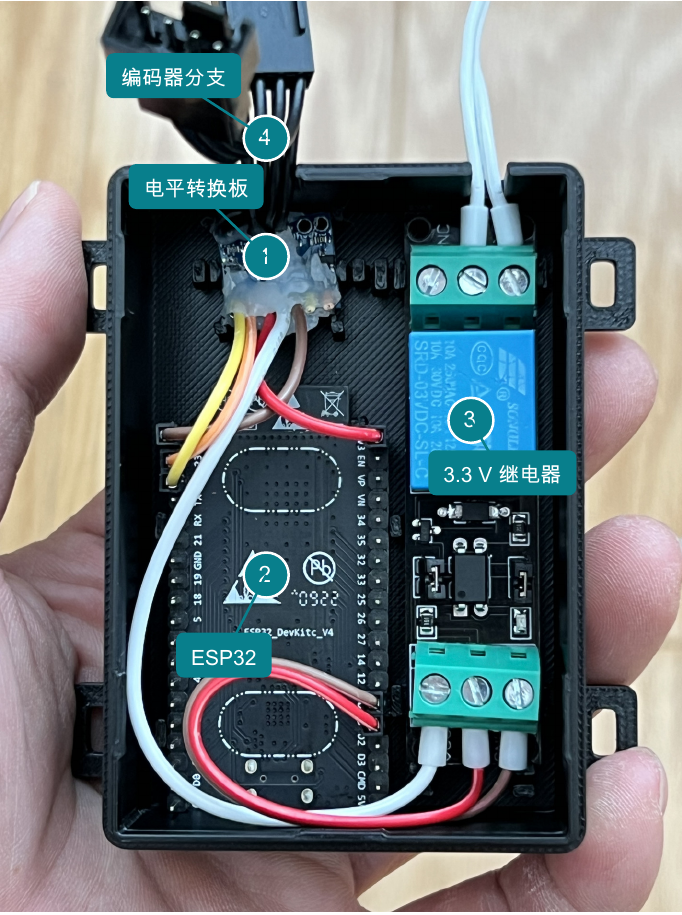

# Wiring & BOM · 接线与物料

| 元件 | 本项目配置 |
|---|---|
| 开门器 | Linear LDCO800，原厂双路编码器 |
| 控制板 | ESP32-WROOM-32E，38-pin、4 MB 开发板 |
| 分线器 | 四线一一连通的 4-pin Y splitter |
| 电平转换 | 四通道 HV/LV 双向转换模块，使用两通道 |
| 继电器 | SRD-03VDC-SL-C 模块，3 V 线圈，高电平触发 |
| 全关参考 | 独立门磁，HA 中 off=全关，on=未全关 |
| 供电 | 独立 USB 给 ESP32；3V3 给电平板 LV 和继电器 VCC |
| 连线 | 盒内短距 28 AWG 杜邦线与 22 AWG 接线，需可靠固定与应力释放 |

图表示电气网络，不能当作任意模块的实际排针顺序。原厂线色仅是本机记录；测量确认后才能套用。

| 原厂网络 | 电平板 | ESP32 |
|---|---|---|
| E4 红，实测约 4.94 V | HV | 不连接 ESP32 3V3 / USB 5V |
| E3 橙，编码器一路 | HV1 → LV1 | GPIO22 |
| E2 棕，编码器另一路 | HV2 → LV2 | GPIO23 |
| E1 黑，地 | GND | GND |
| 低压侧参考 | LV | 3V3 |

编码器和原厂主板之间保留直通路径；额外支路只是并接采集。原厂约 5 V 用于 HV 参考，不为 ESP32 供电。共地并不代表这块转换板提供电气隔离。

## 继电器

- VCC → ESP32 3V3；GND → ESP32 GND；IN → GPIO13。
- COM / NO → 原厂 COMMON / PUSHBUTTON 两个按钮端子；这对触点本身不要求极性。
- NC 不用；不接 BEAM 安全光束端子，也不向按钮端子注入 ESP32 电源。
- 本板供电规格为 3 V 线圈模块。若换成 5 V 模块，必须重新核对模块供电、触发门限和 ESP32 兼容性。

先在 COM/NO 留空时观察一次吸合、约 0.5 秒后释放，再验证上电/复位不误触发。本项目已确认空载吸合释放及最终装机，固件 `ALWAYS_OFF` 不等于证明任何开发板的上电瞬态均无脉冲。

## 安装顺序

1. 断电，核对 Y 线各对应端子的连通与无短路。
2. 先验证原厂线路正常，再接转换板与 ESP32。
3. 在受控现场确认开关方向、满行程计数与关闭参考。
4. 确认继电器脉冲后连接低压按钮端子；整理绝缘、固定和线束应力释放。
5. 接线与验证完成后合盖，确保新增模块与机内市电部分保持合适隔离。
